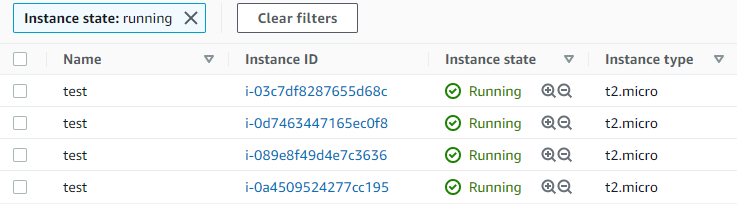
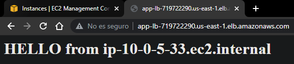
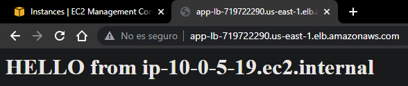
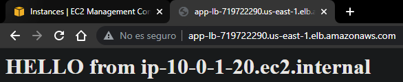
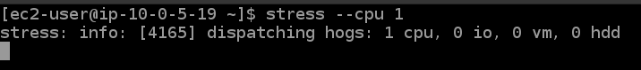
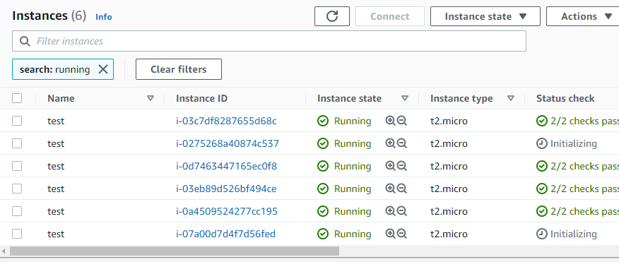
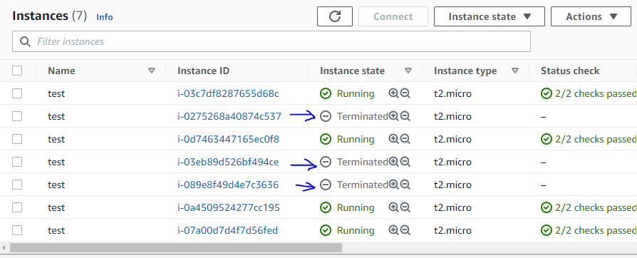

# Terraform AWS Auto Scaling with ALB

## Description

The architecture consists of an auto scaling group with an ALB for load balancing.
For the Auto scaling group, 3 public subnets distributed in different availability zones are taken into account
When the DNS address of the ALB is placed in a browser, it will be possible to see if the load is being distributed among the instances, by printing the hostname on the web page in the following way
To test that our auto scaling group works, CPU stress tests are performed by entering the instances that are created according to the desired number specified in the terraform configuration files, and thus see if the amount of provisioning is decreased. EC2 instances on demand.

## Architecture


The Architecture is designed and implemented in 3 AZs and consists of the following resources:

- 1 Internet Gateway
- 3 Subnets publicas
- 1 Auto Scaling Group
- 1 Application Load Balancer


## Uso
- To create the infrastructure we must execute the following commands:cion
```t
terraform init
terraform validate 
terraform plan
terraform apply -auto-approve
```

# Archivos

## Provider

```t
terraform {
  required_providers {
    aws = {
      source  = "hashicorp/aws"
      version = "~>3.49"
    }
  }
}
provider "aws" {
  profile = "default"
  region  = "us-east-1"
}
```

## 01 - Vars Vpc

```t
variable "cidr" {
  type = string
  default = "10.0.0.0/16"
}

variable "azs" {
  type = list(string)
  default = [   "us-east-1a", 
                "us-east-1b", 
                "us-east-1c"    ]
}

variable "subnets-ips" {
  type = list(string)
  default = [   "10.0.1.0/24",
                "10.0.3.0/24",
                "10.0.5.0/24"  ]
}
```
## 02 - Vpc

```t
resource "aws_vpc" "vpc" {
  cidr_block = var.cidr

  tags = {
    Name = "custom-vpc"
  }
}
```

## 03 - Subnets

```t
resource "aws_subnet" "pub-subnets" {
  count             = "${length(var.azs)}"
  vpc_id            = aws_vpc.vpc.id
  cidr_block        = "${element(var.subnets-ips, count.index)}"
  availability_zone = "${element(var.azs, count.index)}"
  map_public_ip_on_launch = true

  tags = {
    Name = "subnets-${element(var.azs, count.index)}"
  }
}
```

## 04 - Security Groups

```t
resource "aws_security_group" "sg1" {
  name        = "allow-ssh"
  description = "Port 22"
  vpc_id      = aws_vpc.vpc.id

  ingress {
    description = "Allow Port 22"
    from_port   = 22
    to_port     = 22
    protocol    = "tcp"
    cidr_blocks = ["0.0.0.0/0"]
  }

  egress {
    description = "Allow all ip and ports outboun"
    from_port   = 0
    to_port     = 0
    protocol    = "-1"
    cidr_blocks = ["0.0.0.0/0"]
  }
}

resource "aws_security_group" "sg2" {
  name        = "allow-web"
  description = "Port 80"
  vpc_id      = aws_vpc.vpc.id

  ingress {
    description      = "Allow Port 22"
    from_port        = 80
    to_port          = 80
    protocol         = "tcp"
    cidr_blocks      = ["0.0.0.0/0"]
    ipv6_cidr_blocks = ["::/0"]
  }

  egress {
    description = "Allow all ip and ports outboun"
    from_port   = 0
    to_port     = 0
    protocol    = "-1"
    cidr_blocks = ["0.0.0.0/0"]
  }
}

```

## 05 - Internet Gateway

```t
resource "aws_internet_gateway" "i-gateway" {
  vpc_id = aws_vpc.vpc.id

  tags = {
    Name = "i-gateway"
  }
}
```

## 06 - Route Tables

```t
resource "aws_route_table" "pub-table" {
  vpc_id    = "${aws_vpc.vpc.id}"
}

resource "aws_route" "pub-route" {
  route_table_id         = "${aws_route_table.pub-table.id}"
  destination_cidr_block = "0.0.0.0/0"
  gateway_id             = "${aws_internet_gateway.i-gateway.id }"
}

resource "aws_route_table_association" "as-pub" {
  count          = "${length(var.azs)}"
  route_table_id = "${aws_route_table.pub-table.id}"
  subnet_id      = "${aws_subnet.pub-subnets[count.index].id}"  
}
```

## 07 - Launch Template

- Las instancias del tipo `t2.micro` no soportan `ebs_optimized`, por lo cual es importante colocar este parametro en `false`

```t
resource "aws_launch_template" "template" {
  name                  = "ec2-template"
  image_id               = "ami-0dc2d3e4c0f9ebd18"
  instance_type          = "t2.micro"
  vpc_security_group_ids = ["${aws_security_group.sg1.id}", "${aws_security_group.sg2.id}"]
  ebs_optimized          = false #t2.micro doesn;t support
  update_default_version = true
  user_data              = filebase64("http.sh")
  key_name               = "terraform-key"

  # block_device_mappings {
  #   device_name = "/dev/sda1"

  #   ebs {
  #     volume_size           = 12
  #     delete_on_termination = true
  #     volume_type           = "gp2"
  #   }
  # }

  monitoring {
    enabled = true
  }

  tag_specifications {
    resource_type = "instance"
    tags = {
      Name = "test"
    }
  }
}
```
### Archivo -> http.sh <-
```t
#!/bin/bash
sudo yum update -y
sudo yum install httpd -y
sudo systemctl enable httpd
sudo systemctl start httpd
echo "<h1>HELLO from $(hostname -f)</h1>" > /var/www/html/index.html
```

## 08 - Application Load Balancer

```t
resource "aws_lb" "alb" {
  name               = "app-lb"
  internal           = false
  load_balancer_type = "application"
  security_groups    = ["${aws_security_group.sg1.id}", "${aws_security_group.sg2.id}"]
  subnets            = "${aws_subnet.pub-subnets[*].id}"


  tags = {
    Name = "app-lb"
  }
}

resource "aws_lb_target_group" "tg-group" {
  name     = "tg-group"
  port     = 80
  protocol = "HTTP"
  vpc_id   = aws_vpc.vpc.id

  health_check {
    enabled             = true
    interval            = 30
    path                = "/"
    port                = "traffic-port"
    protocol            = "HTTP"
    healthy_threshold   = 3
    unhealthy_threshold = 3
    timeout             = 6
    matcher             = "200-399"
  }
}

resource "aws_lb_listener" "lb-listener" {
  load_balancer_arn = aws_lb.alb.arn
  port              = "80"
  protocol          = "HTTP"

  default_action {
    type             = "forward"
    target_group_arn = aws_lb_target_group.tg-group.arn
  }
}
```

## 09 - Auto Scaling Group

```t
resource "aws_autoscaling_group" "asg" {
  name                = "asg"
  max_size            = 9
  min_size            = 3
  desired_capacity    = 4
  vpc_zone_identifier = "${aws_subnet.pub-subnets[*].id}"
  health_check_type   = "EC2"

  launch_template {
    id      = "${aws_launch_template.template.id}"
    version = "${aws_launch_template.template.latest_version}"
  }

  instance_refresh {
    strategy = "Rolling"
    preferences {
      min_healthy_percentage = 75
    }
  }

}

resource "aws_autoscaling_attachment" "asg-attach" {
  autoscaling_group_name  = "${aws_autoscaling_group.asg.id}"
  alb_target_group_arn    = "${aws_lb_target_group.tg-group.id}"
}

resource "aws_autoscaling_policy" "asg-policy" {
  name                    = "policy-asg"
  autoscaling_group_name  = "${aws_autoscaling_group.asg.id}"
  policy_type             = "TargetTrackingScaling"

  target_tracking_configuration {
    predefined_metric_specification {
      predefined_metric_type = "ASGAverageCPUUtilization"
    }
    target_value = 75.0
  }
}
```

## 10 - Outputs

```t
output "alb-dns" {
  value = "${aws_lb.alb.dns_name}"
}
```

# Test
- Once the `terraform apply -auto-approve` command is executed and the infrastructure creation is finished, the `OUTPUTS` are obtained, especially the private IPS of the EC2 instances and the ALB DNS
- We check if the instances were created according to our `desired_capacity`



- In the same way we check in our Auto Scaling Group


- Then we check the operation of our ALB








- According to the `Auto Scaling Policies` that was specified, it will scale when the CPU consumption exceeds `75%`
- For this we will enter our instances and execute the `stress --cpu 1` command, stressing our instance, increasing CPU consumption to the maximum



- We wait a while and observe that more instances are provisioned to cover the demand
- Additional instances are created to cover the demand



- We stop executing the `stress --cpu 1` command and the CPU consumption will drop, so it will no longer be necessary to have the instances that were created when the demand increased, therefore these instances will be `terminated` automatically , until we get back to the `desired_capacity`


 


